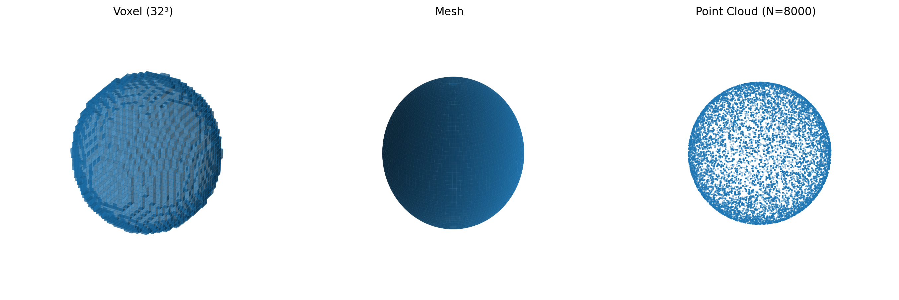

# 背景知识

## 1. 3D 表示方法概述

### 1.1 体素

体素是三维空间中的像素，与二维图像中的像素类似，但增加了深度维度。在一个三维的形状中，每个体素用来表示这个位置是否被形状占据。

- 优点：直观，易于理解
- 缺点：储存 voxel 的空间复杂度是 $O(n^3)$，通常计算复杂度较高。

### 1.2 网格

网格使用点、线、面来描述 3D 形状。

- 优点：紧凑、直观，适合渲染处理
- 缺点：依赖拓扑结构，通常需要 watertight mesh，需要较为复杂的预处理

### 1.3 点云

点云由一组离散的点组成，用来描述在 3D 形状上的点。

- 优点：无需拓扑结构，无需预处理，表示灵活。
- 缺点：点云的表示是离散、稀疏的，缺乏连续性。

---

## 2. 潜在表示

### 2.1 潜在表示简介

潜在表示即将高维的数据映射到低维向量。通常，原始数据的维度较高，难以直接处理。而这些向量是稠密的、压缩的，具有一定语义的。

在本实验中，我们将点云这种离散、稀疏的数据映射为 Shape Tokens，实现对数据的稠密化、连续化、语义化。

由这些低维向量组成的空间被称为**潜空间 (latent space)**。

### 2.2 共享潜空间

不同模态或者不同数据源的表示被映射到同一个潜空间。例如，对于同一个形状的不同点云采样，它们在这个潜空间中的表示应当是接近的，这也正是一致性正则的原理；对于同一个形状的不同模态的描述，它们在这个潜空间中的表示也应当是接近的，这为这份工作在多模态中的应用打下了基础。

---

## 3. 位置编码器与时间编码器

### 3.1 位置编码器

#### 3.1.1 动机

普通的 MLP 或线性层在处理输入时，对高频信息的建模能力较弱。为了让模型能够捕捉局部几何的细节，我们需要引入多尺度的正弦/余弦函数，将输入坐标映射到更高维空间。这种方法本质上是**傅里叶特征映射**。

#### 3.1.2 方法

对于给定的位置 $x \in \mathbb{R}$ 和频率数量 $L$，位置编码定义为：

$$
\gamma(x) = \big(x,\ \sin(2^0 \pi x), \cos(2^0 \pi x), \ldots, \sin(2^{L-1}\pi x), \cos(2^{L-1}\pi x)\big).
$$

不同频率的正弦/余弦项可以让模型感知到从低频到高频的几何变化，从而提升对复杂表面形状的表达能力。
在三维点云中，我们对 $(x,y,z)$ 的每一维分别做 Fourier 映射，再拼接得到高维的点位置编码。

### 3.2 时间编码器

#### 3.2.1 动机

在流匹配中，点的运动轨迹与时间步 $t$ 强相关。为了让模型能够理解“在不同时间步点应如何流动”，我们同样需要一种多尺度的时间表示。

#### 3.2.2 方法

对于给定的时间 $t \in [0,1]$ 和频率数量 $L$，时间编码为：

$$
\gamma(t) = \big(\sin(2^0 \pi t), \cos(2^0 \pi t), \ldots, \sin(2^{L-1}\pi t), \cos(2^{L-1}\pi t)\big).
$$

与位置编码类似，不同频率的分量让模型同时感知短程和长程的时间依赖。

> 在实现过程中，时间编码器与 `Linear+SiLU+Linear` 的结构共同封装在 `TimeEncoder` 内。

---

## 4. 自适应归一化层

在流匹配中，输入不仅包含点的坐标特征 $x$，还依赖例如时间步 $t$ 等额外的条件变量。不同时间下，数据分布差异显著。若仅使用固定参数的**标准 Layer Normalization**，模型难以同时适配所有时间分布。
因此，我们引入**自适应归一化层（AdaLN）**，使归一化过程能够随条件动态调节。

### 4.1 标准 Layer Normalization

给定输入 $x \in \mathbb{R}^d$，标准 LayerNorm 的计算过程为：

$$
\text{LN}(x) = \frac{x - \mu}{\sigma}, \quad 
\mu = \tfrac{1}{d}\sum_{i=1}^d x_i,\ 
\sigma = \sqrt{\tfrac{1}{d}\sum_{i=1}^d (x_i-\mu)^2}.
$$

通常会再引入可学习的缩放与偏移参数 $\gamma, \beta$：

$$
y = \gamma \cdot \text{LN}(x) + \beta.
$$

这里的 $\gamma,\beta$ 是与输入无关的全局参数。

### 4.2 自适应归一化层

在 **AdaLN** 中，缩放与偏移不再是固定参数，而是由**条件向量**（在流匹配中即时间嵌入 $t_{\text{emb}}$）动态生成：

$$
\gamma = W_{\text{scale}} \, t_{\text{emb}}, \quad 
\beta = W_{\text{shift}} \, t_{\text{emb}}.
$$

于是有：

$$
\text{AdaLN}(x, t_{\text{emb}}) = \text{LN}(x) \cdot (1+\gamma) + \beta.
$$

---

## 5. Shift & Scale & Gating

在流匹配（Flow Matching）的 Velocity Estimator 中，除了基本的归一化外，还引入了 **Shift、Scale 和 Gating** 机制，用于根据时间步 $t$ 对特征进行动态调制。

### 5.1 Shift & Scale

对于输入特征 $x \in \mathbb{R}^d$，首先通过 LayerNorm 或 AdaLayerNorm 得到归一化结果 $x_{\text{norm}}$。  
接着利用时间嵌入 $t_{\text{emb}}$ 生成两个向量：

\[
\text{shift} = W_{\text{shift}} \, t_{\text{emb}}, 
\quad
\text{scale} = W_{\text{scale}} \, t_{\text{emb}},
\]

然后对归一化后的特征进行调制：

\[
x' = x_{\text{norm}} \cdot (1 + \text{scale}) + \text{shift}.
\]

这样，特征的分布会随着时间步 $t$ 的变化而自适应地调整。

### 5.2 Gating

除了 Shift & Scale 外，模型还引入了 **门控（Gating）机制**，即通过一个 sigmoid 激活函数将时间嵌入映射到 $[0,1]$ 范围：

\[
g = \sigma(W_{\text{gate}} \, t_{\text{emb}}),
\]

并将其作用在输出上：

\[
h = f(x') \cdot g,
\]

其中 $f(\cdot)$ 表示 Cross Attention 或 MLP 等子模块的输出。

门控机制的作用是 **控制信息流的强弱**：  

- $g \approx 0$ 时，抑制该时间步的特征；  
- $g \approx 1$ 时，完全保留该时间步的特征；  
- $g$ 在 $(0,1)$ 之间时，相当于“软选择”，灵活调节特征强度。

--- 

## 6. 倒角距离

### 6.1 动机

在 3D 点云生成与重建任务中，我们需要一种指标来衡量生成点云与真实点云之间的相似性。由于点云是无序集合，传统的 MSE 无法直接应用，因此需要一个对点集排列不敏感的度量方法。**倒角距离 (Chamfer Distance)** 就是目前最常用的指标之一。

### 6.2 定义

设有两个点集：

$$
X = \{x_i\}_{i=1}^N, \quad Y = \{y_j\}_{j=1}^M, \quad x_i,y_j \in \mathbb{R}^d,
$$

倒角距离定义为：

$$
d_{\text{CD}}(X,Y) = \frac{1}{|X|} \sum_{x \in X} \min_{y \in Y} \|x-y\|_2^2 + \frac{1}{|Y|} \sum_{y \in Y} \min_{x \in X} \|y-x\|_2^2.
$$

- **第一项**：衡量 $X$ 中的点在 $Y$ 中最接近的对应点；
- **第二项**：相应地，衡量 $Y$ 中的点在 $X$ 中最接近的点。

> 在本实验中，Chamfer Distance 被用于衡量**重建点云与真实点云的差异**，反映模型在几何恢复上的准确性。

