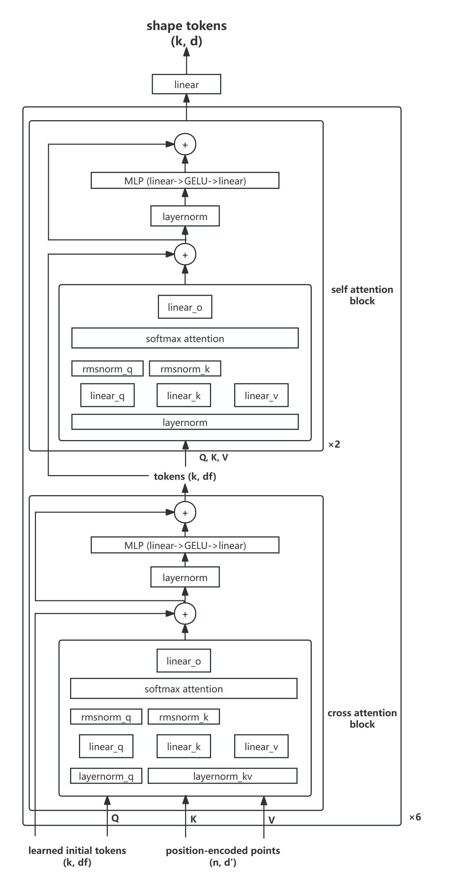
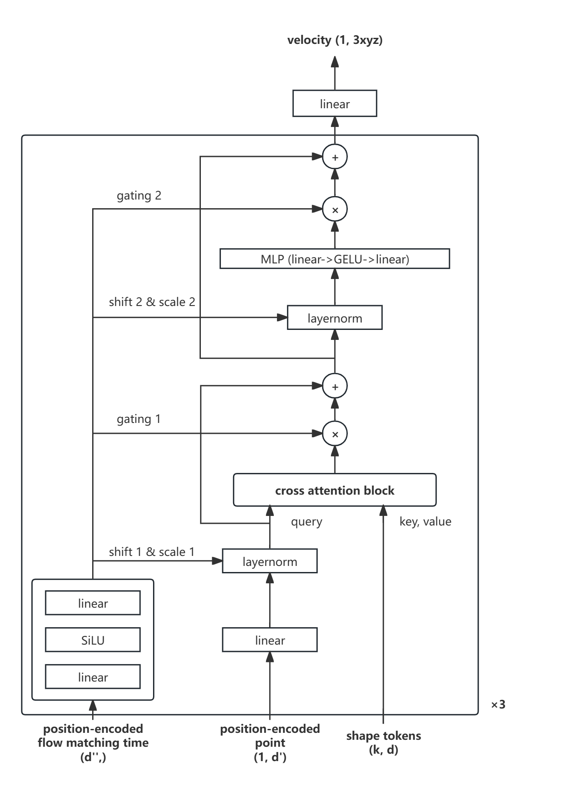

# 3D Shape Tokenization 复现报告

## 1. 实验背景

3D Shape Tokenization 是 Apple 公司在 ["3D Shape Tokenization via Latent Flow Matching"](https://arxiv.org/abs/2412.15618) 中提出的一种将 3D 形状转换为低维表示的方法，并称之为 Shape Token。

在传统的 3D 形状表示方法中，3D 形状通常被表示为点云、网格或者是体素等形式。但是这些表示方法难以同时满足连续、紧凑与预处理少这三个要求 (TODO: 为什么?)。于是，Apple 公司提出了一种通过flow matching学习3D形状的**共享潜空间**的方法来满足以上特性。根据论文报告，这种表示方法除了满足连续、紧凑等特性，同时只需要从3D形状的表面采样一定的点云，此外还具有一定的几何能力 (TODO: 具体是什么?)。

## 2. 数据集简介

### 2.1 ShapeNetCore

在本实验中，我们选取了 ShapeNetCore 作为数据集。该数据集具有约 50,000 个 3D 形状, 包括桌子、椅子、飞机等约 50 个类别，我们选用的是 [ShapeNetCore.v2.PC15k](https://drive.google.com/drive/folders/1MMRp7mMvRj8-tORDaGTJvrAeCMYTWU2j) 版本, 其中的 3D 形状以点云形式给出。我们按照数据集中的划分方式完成训练和测试.

### 2.2 Demo

在复现的初步阶段，为了在算力不足的情况下验证模块的效果，我们选取了其中的 4 个类别，约 20,000 个形状进行训练和测试。

### 2.3 数据集格式

数据集的格式如下：

```txt
ShapeNetCore.v2.PC15k/
│
├── 02691156/
│   ├── train/
│   │   ├── xxx.npy
│   │   ├── yyy.npy
│   │   └── ...
│   ├── val/
│   │   ├── ...
│   ├── test/
│   │   ├── ...
│   └── ...
│
├── 02958343/
│   ├── train/
│   ├── val/
│   ├── test/
│
└── ...
```

Demo 数据集包含的类别为: `02691156`, `02747177`, `03001627`, `04379243`。


## 3. 实验方法

### 3.1 Shape Tokenizer

#### 3.1.1 简介

Shape Tokenizer 相当于模型的编码器，它的目标是将 3D 形状 (本实验中为点云) 映射到低维的潜在表示，这些潜在表示也将用作后续 Velocity Estimator 的输入，它们用于描述 3D 形状的概率分布。

#### 3.1.2 模型结构

Shape Tokenizer 的结构如下图:



Shape Tokenizer 将点云编码为 $k$ 个 $d$ 维的 Shape Token。在 Shape Tokenizer 内部，Shape Token 的维度为 $d_f$。

初始状态下，我们随机生成 $k$ 个 $d_f$ 维的 Shape Token，同时通过位置编码器将输入点云中的 $n$ 个点编码为 $d'$ 维的向量。我们使用 Shape Tokens 作为交叉注意力模块中的查询，位置编码作为键值，从点云中提取全局几何特征。同时使用残差连接、归一化和 MLP 来增强训练的稳定性, 经过交叉注意力模块后, 我们得到 $k$ 个 $d_f$ 维的 Shape Token。接着我们采用 2 个堆叠的自注意力模块，建立 Token 之间的依赖关系. 我们选择重复上述模块 6 次以达到细化 Token 表示的目的。最终经过一个线性层，我们得到 $k$ 个 $d$ 维的 Shape Token。它将作为后续 Velocity Estimator 的输入。

### 3.2 Velocity Estimator

#### 3.2.1 简介

Velocity Estimator 是模型的解码器，它的目标是将 Shape Token 解码为 3D 形状的表面点云。Velocity Estimator 的输入为 Shape Token、经过位置编码的点以及经过位置编码的时间步。**这是因为 Velocity Estimator 本质上是在学习每个点随时间步的运动情况。**

#### 3.2.2 模型结构

Velocity Estimator 的结构如下图:



Velocity Estimator 接收 Shape Tokenizer 编码的 $k$ 个 $d$ 维的 Shape Token，同时通过位置编码器将当前时间步编码为 $d''$ 维的向量，将当前点的位置编码为 $d'$ 的向量。时间编码 $t_{emb}$ 首先经过线性层和 SiLU 激活函数，然后生成 Shift 向量和 Scale 向量，去指导位置编码 $x_{emb}$ 经过线性层与归一化层（自适应归一化层）后的调制，调制的结果作为交叉注意力模块的询问，Shape Tokens 作为键值，得到的结果经过 gating 后与归一化后的 $x_{emb}$ 进行残差连接，然后将交叉注意力模块换成一个多层感知机，重复相似过程。最终重复上述模块 3 次，得到在当前时间步下，特定点在 Shape Token 下的运动方向。

> 在实现中, $d''$ 与 $d$ 的维度相同。

> **自适应归一化层的结构仍需继续确认。**

### 3.3 Flow Matching

通过 Shape Tokenizer 和 Velocity Estimator，我们可以得到在任意时间步下，特定点在 Shape Token 引导下的运动方向。我们初始化一个随机噪声 $x_0 \in \mathbf{R}^{n \times 3}$，通过以下公式计算点云最终的位置 $x_1$:

$$x_1 = x_0 + \int_{0}^{1}v_{\theta}(x_t;s,t) \mathrm{d} t$$

其中 $v_{\theta}(x_t;s,t)$ 为 Velocity Estimator 在时间步 $t$ 下，点 $x_t$ 的运动方向。我们通过 Heun 积分方法近似上述表达式的数值：

- 设时间步之间的间隔为 $h$。对于每一个时间步 $t$，先计算 $v_1 = v_{\theta}(x_t;s,t)$，令 $\tilde{x} \leftarrow x_t + h \cdot v_1$。
- 然后计算 $v_2 = v_{\theta}(\tilde{x};s,t+h)$，令 $x_{t+1} \leftarrow x_t + \frac{h}{2} \cdot (v_1 + v_2)$。
- 令 $t \leftarrow t + h$，重复上述过程，直到 $t = 1$。

### 3.4 损失函数

损失函数由 $3$ 部分组成，分别为重建损失、一致性正则和先验正则。

重建损失的表达式为：

\[
\mathcal{L}_{\text{flow}} = \mathbb{E}_{t, x_0, x_1} \left[ \left\| v_\theta(x_t; s, t) - \dot{\alpha}_t x - \dot{\sigma}_t \epsilon \right\|^2 \right].
\]

为了让同一形状的不同子采样 $Y, Z$ 得到的一致的 tokens，我们希望 $q_\theta(s \mid Y)$ 与 $p_\theta(s \mid Z)$ 尽可能接近。我们使用 KL 散度作为一致性正则。我们设 $q_\theta(s \mid Y)$ 与 $p_\theta(s \mid Z)$ 为高斯分布：

\[
q_\theta(s \mid Y) = \mathcal{N}(\mu_\theta(Y), \sigma^2 I), \quad 
p_\theta(s \mid Z) = \mathcal{N}(\mu_\theta(Z), \sigma^2 I).
\]  

我们可以得到：

\[
D_{\mathrm{KL}}\big(\mathcal{N}(\mu_Y, \sigma^2 I) \,\|\, \mathcal{N}(\mu_Z, \sigma^2 I)\big) 
\propto \frac{1}{2\sigma^2} \left\| \mu_Y - \mu_Z \right\|_2^2.
\]

此外，我们通过 $p(S) = \mathcal{N}(0, I)$ 的约束让 token 不发散，我们加上先验正则:

\[
D_{\mathrm{KL}}\big(q_\theta(s \mid Y) \,\|\, p(s)\big)
\]

它等价于:
\[
\frac{1}{2} \left\| \mu_\theta(Y) \right\|_2^2
\]

综上，我们的损失函数的表达式为：

\[
\boxed{ \mathcal{L} = \mathcal{L}_{\text{flow}} + \lambda_1 \left\| \mu_Y - \mu_Z \right\|_2^2 + \lambda_2 \left\| \mu_\theta(Y) \right\|_2^2. }
\]

## 4. 实验结果

## 5. 分析与讨论

## 6. 附录

### 6.1 复现指南

### 6.2 代码结构

### 6.3 参考资料