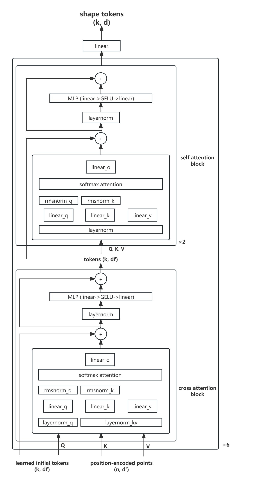

# 3D Shape Tokenization 复现报告

## 1. 实验背景

3D Shape Tokenization 是 Apple 公司在 ["3D Shape Tokenization via Latent Flow Matching"](https://arxiv.org/abs/2412.15618) 中提出的一种将 3D 形状转换为低维表示的方法，并称之为 Shape Token。

在传统的 3D 形状表示方法中，3D 形状通常被表示为点云、网格或者是体素等形式。但是这些表示方法难以同时满足连续、紧凑与预处理少这三个要求 (TODO: 为什么?)。于是，Apple 公司提出了一种通过flow matching学习3D形状的**共享潜空间**的方法来满足以上特性。根据论文报告，这种表示方法除了满足连续、紧凑等特性，同时只需要从3D形状的表面采样一定的点云，此外还具有一定的几何能力 (TODO: 具体是什么?)。

## 2. 数据集简介

### 2.1 ShapeNetCore

在本实验中，我们选取了 ShapeNetCore 作为数据集。该数据集具有约 50,000 个 3D 形状, 包括桌子、椅子、飞机等约 50 个类别，我们选用的是 [ShapeNetCore.v2.PC15k](https://drive.google.com/drive/folders/1MMRp7mMvRj8-tORDaGTJvrAeCMYTWU2j) 版本, 其中的 3D 形状以点云形式给出。我们按照数据集中的划分方式完成训练和测试.

### 2.2 Demo

在复现的初步阶段，为了在算力不足的情况下验证模块的效果，我们选取了其中的 4 个类别，约 20,000 个形状进行训练和测试。

### 2.3 数据集格式

数据集的格式如下：

```txt
ShapeNetCore.v2.PC15k/
│
├── 02691156/
│   ├── train/
│   │   ├── xxx.npy
│   │   ├── yyy.npy
│   │   └── ...
│   ├── val/
│   │   ├── ...
│   ├── test/
│   │   ├── ...
│   └── ...
│
├── 02958343/
│   ├── train/
│   ├── val/
│   ├── test/
│
└── ...
```

Demo 数据集包含的类别为: `02691156`, `02747177`, `03001627`, `04379243`。


## 3. 实验方法

### 3.1 背景知识

### 3.2 Shape Tokenizer

#### 3.2.1 简介

Shape Tokenizer 相当于模型的编码器，它的目标是将 3D 形状 (本实验中为点云) 映射到低维的潜在表示，这些潜在表示也将用作后续 Velocity Estimator 的输入，它们用于描述 3D 形状的概率分布。

#### 3.2.2 模型结构

Shape Tokenizer 的结构如下图:




### 3.3 Velocity Estimator

## 4. 实验结果

## 5. 分析与讨论

## 6. 附录

### 6.1 复现指南

### 6.2 代码结构

### 6.3 参考资料