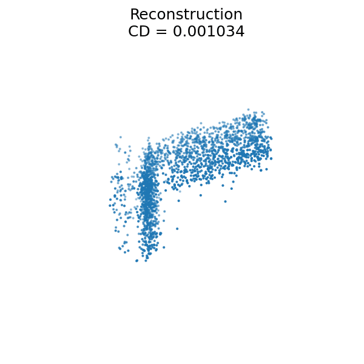
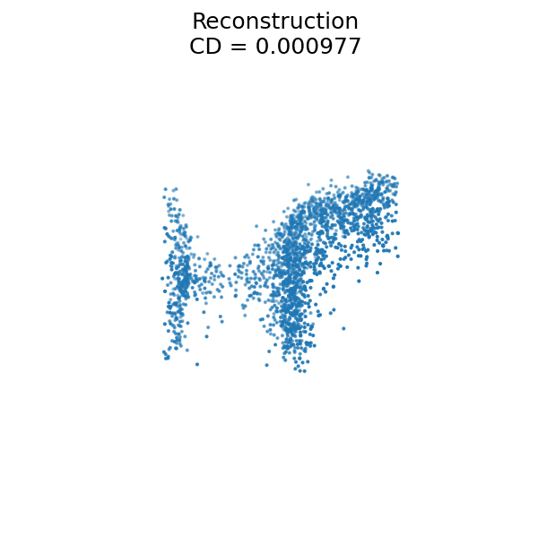
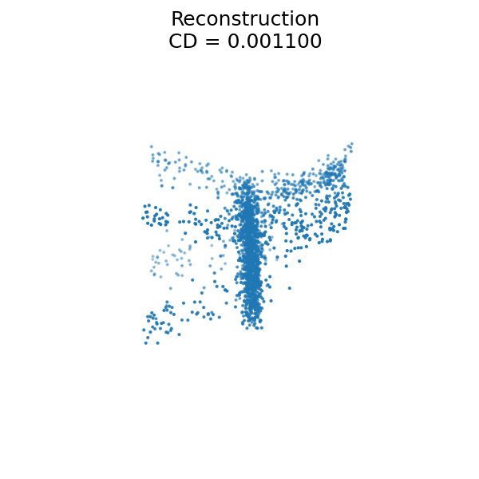
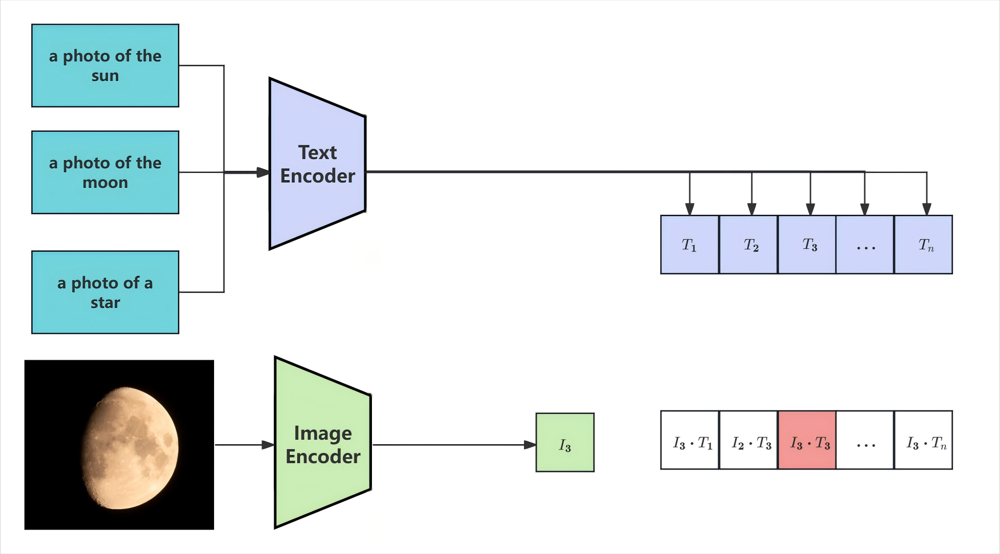
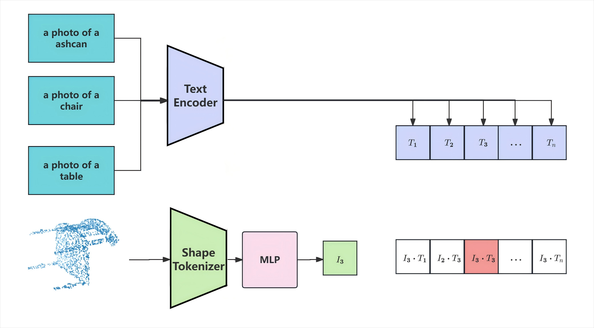

# 3D Shape Tokenization 复现报告

## 1. 实验背景

3D Shape Tokenization 是 Apple 公司在 ["3D Shape Tokenization via Latent Flow Matching"](https://arxiv.org/abs/2412.15618) 中提出的一种将 3D 形状转换为低维表示的方法，并称之为 Shape Token。

### 1.1 传统方法的不足

在传统的 3D 形状表示方法中，形状通常被表示为**点云 (Point Cloud)**、**网格 (Mesh)** 或者**体素 (Voxel)** 等形式。但这些表示方法存在以下不足：

- **体素 (Voxel)**：虽然规则，但维度极高（存储复杂度为 $O(n^3)$），计算和内存开销过大，不够紧凑。
- **网格 (Mesh)**：需要拓扑结构，通常要求 **watertight mesh**，而大规模数据集中的大部分网格并不 watertight，导致训练前需复杂预处理。
- **点云 (Point Cloud)**：易获取（深度传感器直接输出），但它只是离散样本，缺乏连续性和紧凑性，难以作为机器学习模型的直接输入。

因此，很难同时满足以下三个需求：

- **连续性**：表示形式应当是连续可微的，以支持梯度传播和几何计算；
- **紧凑性**：在内存和计算上足够高效；
- **最少预处理**：避免复杂的 mesh 修复、体素化或 SDF 提取等步骤。

### 1.2 本方法的改进

Apple 提出了一种基于**流匹配** 的方法，将 3D 形状 $S$ 看作三维空间中的**概率密度函数** $p(x,y,z)$，其概率质量集中在物体表面。通过学习一个共享潜空间，每个 Shape Token $s$ 参数化条件分布 $p(x|s)$。

这种方法的优势包括：

- **连续与紧凑**：仅使用 **1024 个 16 维的连续向量** 就能表示复杂形状。
- **预处理少**：仅需表面点云，无需 watertight mesh，也无需构造占据场或 SDF。
- **可扩展性**：能够直接在 **Objaverse** 等大规模数据集上训练，而传统方法因 watertight 要求无法做到。

> 此外，虽然本方法完全数据驱动，但是它仍然具有一定的几何能力，可以完成例如零样本表面法线估计等任务。

---

## 2. 数据集简介

### 2.1 ShapeNetCore

在本实验中，我们选取了 **ShapeNetCore** 作为数据集。该数据集包含约 **55 个类别、50,000+ 个 3D 形状**，涵盖桌子、椅子、飞机等常见物体。

我们采用 [**ShapeNetCore.v2.PC15k**](https://drive.google.com/drive/folders/1MMRp7mMvRj8-tORDaGTJvrAeCMYTWU2j) 版本，其中的每个 3D 形状均以**点云形式**给出，每个形状包含约 15,000 个点。按照标准划分，数据集被分为 **train / val / test** 三部分。

### 2.2 Demo 实验

在复现的初步阶段，为了在算力不足的情况下快速验证模型的有效性，我们从中选取了 **4 个类别**（共约 20,000 个形状）进行训练与测试。

选取的类别包括：

* `02691156` (airplane)
* `02747177` (ashcan)
* `03001627` (chair)
* `04379243` (table)

这一子集既能覆盖 ShapeNet 的主要类别，又能在有限算力条件下进行模型验证。

### 2.3 数据集格式

数据集的结构如下：

```txt
ShapeNetCore.v2.PC15k/
│
├── 02691156/          # 类别: airplane
│   ├── train/
│   │   ├── xxx.npy    # 点云文件
│   │   ├── yyy.npy
│   │   └── ...
│   ├── val/
│   ├── test/
│
├── 02958343/          # 类别: car
│   ├── train/
│   ├── val/
│   ├── test/
│
└── ...
```

每个 `.npy` 文件存储一个点云，形状为 `[N, 3]`，其中 $N=15000$，每一行是一个点的三维坐标 $(x,y,z)$。在训练与评估时，我们会从中随机采样 2048 个点作为输入。

---

## 3. 实验方法

### 3.1 Shape Tokenizer

#### 3.1.1 简介

**Shape Tokenizer** 相当于模型的**编码器**，它的目标是将 3D 形状（本实验中为点云）映射到低维的潜在表示 **Shape Tokens**。这些 Shape Tokens 将作为后续 **Velocity Estimator** 的输入，用于参数化条件分布 $p(x|s)$，进而描述 3D 形状的概率密度函数。

#### 3.1.2 模型结构

Shape Tokenizer 的整体结构如下图：


- **输入**：点云 $X = \{x_i\}_{i=1}^n$，其中 $x_i \in \mathbb{R}^3$。
- **输出**：$k$ 个 $d$ 维 Shape Tokens，组成潜在表示 $s \in \mathbb{R}^{k \times d}$。

具体步骤如下：

1. **位置编码**
   将点云坐标 $(x,y,z)$ 编码为高维向量 $x' \in \mathbb{R}^{d'}$，包含多频率的正弦/余弦分量。这使得模型能够感知不同尺度的几何信息。

2. **点特征投影**
   将编码后的 $x'$ 投影到维度 $d_f$，得到点特征矩阵 $F \in \mathbb{R}^{n \times d_f}$。

3. **可学习 Token 初始化**
   初始化 $k$ 个 $d_f$ 维的 token，记作 $T^{(0)} \in \mathbb{R}^{k \times d_f}$，在训练中更新。

4. **Cross Attention Block**
    - Query: 当前 tokens $T^{(l)}$
    - Key/Value: 点特征 $F$
    - 作用：提取全局几何信息，将点云特征聚合到 tokens。

5. **Self Attention Block**
    - Query/Key/Value: tokens 自身
    - 作用：建模 token 间依赖关系，增强上下文信息。
    - 每次迭代结构为：Cross Attention → Self Attention ×2。

6. **堆叠结构**
   将 Cross + Self Attention Block 组成的 **TokenBlock** 堆叠 6 次，逐步细化 Shape Token 的表示。

7. **线性映射**
   最终通过 `Linear(d_f → d)` 将 $d_f$ 维 tokens 映射到 $d$ 维，得到 $s \in \mathbb{R}^{k \times d}$，用于后续 Velocity Estimator。

### 3.2 Velocity Estimator

#### 3.2.1 简介

**Velocity Estimator** 是模型的**解码器**，目标是利用 Shape Tokens 恢复原始 3D 形状。它的本质是学习一个**速度场** $v_\theta(x; s, t)$，描述点 $x$ 在时间 $t$ 下的运动方向。

- **输入**：
    1. Shape Tokenizer 编码的 $k \times d$ 维 Shape Tokens $s$；
    2. 点的 Fourier 位置编码 $x_{\text{emb}} \in \mathbb{R}^{d'}$；
    3. 时间步的 Fourier 位置编码 $t_{\text{emb}} \in \mathbb{R}^{d''}$。

- **输出**：预测的速度向量 $\Delta x \in \mathbb{R}^3$，用于 ODE 积分还原形状点云。

Velocity Estimator 学习**如何让噪声点逐步流动到形状表面**。

#### 3.2.2 模型结构

Velocity Estimator 的整体结构如下图：


具体流程如下：

1. **点位置编码 (FourierPositionalEncoding3D)**
   原始点 $x \in \mathbb{R}^3$ 被编码为 $x_{\text{emb}} \in \mathbb{R}^{d'}$，提供多尺度的几何特征。

2. **时间编码 (TimeEncoder)**
   时间步 $t \in [0,1]$ 被编码为 $t_{\text{emb}} \in \mathbb{R}^{d''}$。

3. **自适应归一化 (AdaLayerNorm)**
   使用 $t_{\text{emb}}$ 生成 **Shift** 和 **Scale** 向量，对 $x_{\text{emb}}$ 进行调制：

   $$
   \text{AdaLN}(x, t_{\text{emb}}) = \text{LayerNorm}(x) \cdot (1 + \text{Scale}(t_{\text{emb}})) + \text{Shift}(t_{\text{emb}})
   $$

   使得模型能感知“在不同时间步，点应该如何移动”。

4. **Cross Attention 与 Shape Tokens**
    - Query：调制后的 $x_{\text{emb}}$；
    - Key/Value：Shape Tokens $s$；
    - 作用：融合形状全局特征，引导点 $x$ 的运动。

5. **Gating 门控机制**
   使用 $t_{\text{emb}}$ 生成门控向量，通过 $\sigma(\cdot)$ 抑制/放大注意力输出，再与 $x_{\text{emb}}$ 残差连接，提升稳定性。

6. **MLP 前馈网络**
   将 Cross Attention 替换为 MLP，重复归一化、Shift & Scale、Gating、残差的流程。

7. **模块堆叠**
   将上述 **VelocityEstimatorBlock** 堆叠 3 次，逐步调整点的运动方向。

8. **线性输出层**
   将隐藏特征投影为 $\mathbb{R}^3$，得到速度向量 $v(x, s, t)$，用于 Heun ODE 解算点的轨迹。


> 在实现中, $d''$ 与 $d$ 的维度相同。


### 3.3 Flow Matching

通过 **Shape Tokenizer** 和 **Velocity Estimator**，我们可以得到在任意时间步 $t$ 下，点 $x_t$ 在 Shape Token 引导下的运动方向。

> **Velocity Estimator 学习流匹配中的速度场 $v_\theta(x_t; s, t)$**，其目标是将初始噪声分布 $p_0$ 逐步变换为目标点云分布 $p_1$。

我们初始化一个随机噪声 $x_0 \in \mathbb{R}^{n \times 3}$，最终点云 $x_1$ 的生成过程为：

$$
x_1 = x_0 + \int_{0}^{1} v_{\theta}(x_t; s, t)\, \mathrm{d}t
$$

其中：

- $x_t$：时间 $t$ 下的点云；
- $s$：Shape Tokenizer 提取的 latent tokens；
- $v_\theta$：Velocity Estimator 预测的速度场。


### 3.4 Heun 方法

由于积分无法解析求解，我们采用 **Heun 积分** 进行近似计算：

1. 设时间步之间的间隔为 $h = \dfrac{1}{\text{steps}}$；

2. 对于每一个时间步 $t$：
    1. 计算 $v_1 = v_{\theta}(x_t; s, t)$；
    2. 更新临时点 $\tilde{x} \leftarrow x_t + h \cdot v_1$；
    3. 计算 $v_2 = v_{\theta}(\tilde{x}; s, t+h)$；
    4. 更新 $x_{t+1} \leftarrow x_t + \tfrac{h}{2} \cdot (v_1 + v_2)$；

3. 重复上述过程，直到 $t=1$，得到最终点云 $x_1$。

### 3.5 损失函数

损失函数由 **3 部分**组成，分别是 **流匹配损失（Flow Matching Loss）**、**一致性正则（Consistency Regularization）** 和 **先验正则（Prior Regularization）**。

#### 3.5.1. 流匹配损失

流匹配的核心思想是逼近真实的速度场 $\dot{x}_t\$。在论文中，噪声与数据之间的路径由以下参数化表示：

$$
x_t = \alpha_t x_1 + \sigma_t \epsilon, \quad \epsilon \sim \mathcal{N}(0, I)
$$

其时间导数为：

$$
\dot{x}_t = \dot{\alpha}_t x_1 + \dot{\sigma}_t \epsilon
$$

> 在实现中，我们使用 $\dot{\alpha}_t = t$，$\dot{\sigma}_t = 1 - t$。

因此，Velocity Estimator 学习的速度场 $v_\theta(x_t; s, t)$ 需要拟合该真实导数。对应的损失为：

$$
\mathcal{L}_{\text{flow}} = \mathbb{E}_{t, x_0, x_1} \Big[ \| v_\theta(x_t; s, t) - \dot{\alpha}_t x_1 - \dot{\sigma}_t \epsilon \|^2 \Big]
$$

#### 3.5.2. 一致性正则

为了让同一形状的不同子采样 $Y, Z$ 映射到一致的 tokens，我们希望 $q_\theta(s \mid Y)$ 与 $p_\theta(s \mid Z)$ 尽可能接近。设其为高斯分布：

$$
q_\theta(s \mid Y) = \mathcal{N}(\mu_\theta(Y), \sigma^2 I), \quad 
p_\theta(s \mid Z) = \mathcal{N}(\mu_\theta(Z), \sigma^2 I)
$$

其 KL 散度为：

$$
D_{\mathrm{KL}}\big(\mathcal{N}(\mu_Y, \sigma^2 I) \,\|\, \mathcal{N}(\mu_Z, \sigma^2 I)\big) 
= \frac{1}{2\sigma^2} \| \mu_Y - \mu_Z \|_2^2
$$

#### 3.5.3. 先验正则

为了防止 tokens 发散，论文中引入了标准高斯先验 $p(s) = \mathcal{N}(0, I)$。因此添加如下约束：

$$
D_{\mathrm{KL}}(q_\theta(s \mid Y) \,\|\, p(s)) = \frac{1}{2} \| \mu_\theta(Y) \|_2^2
$$

#### 3.5.4. 总损失

最终损失为：

$$
\boxed{ 
\mathcal{L} = \mathcal{L}_{\text{flow}} + \lambda_1 \| \mu_Y - \mu_Z \|_2^2 + \lambda_2 \| \mu_\theta(Y) \|_2^2
}
$$

其中 $\lambda_1, \lambda_2$ 为权重系数。

---


## 4. 实验结果

### 4.1 在 Chair 数据集上的拟合情况

我们首先在 Chair 数据集上测试了模型的表现。

超参数设置如下：

```json
"config": {
   "batch_size": 32,
   "num_points": 2048,
   "epochs": 1000,
   "lr": 0.4,
   "weight_decay": 0.0,
   "d_f": 512,
   "d": 64,
   "num_tokens": 32,
   "kl_weight": 0.001,
   "kl_prior_weight": 0.0001,
   "data_root": "/root/autodl-fs/chair",
   "patience": 15,
   "warmup_steps": 4000,
   "fm_M": 64
}
```

训练过程中，采用 Flow Matching Loss + KL 正则项 作为目标函数，学习率使用 Transformer 风格的 warmup 调度策略，warmup 步数为 4000。最终在 第 98 个 epoch 停止训练。

我们利用保存的最佳模型参数，在测试集上进行了重建实验，采用 Chamfer Distance 作为主要指标，点数固定为 2048。重建的平均误差为 $1.44 \times 10^{-3}$。

{ width=400px } { width=400px }

{ width=400px } { width=400px }

可以看出，模型能够生成出不同类型的椅子。

### 4.2 在 Demo 数据集上的分类情况

由于 Demo 数据集相比 Chair 数据集较大，在评估时，我们并没有进行所有测试集的重建任务。但是，通过[可视化结果](index.html)，我们可以看出，模型同样可以拟合多种类的点云。


## 5. 分析与讨论

### 5.1 原实验分析

在原实验中，我们实现了在 Chair 数据集与更大的、包含 4 种物品类别的数据集上的拟合任务。从可视化结果表明，模型能够根据不同类型的物体提取不同的 Shape Token，通过 Shape Token 引导 Flow Matching，生成出与原始点云形状相近的点云。

此外，通过观察可视化结果，我们发现在一些例如椅子腿等精细细节上，模型重建的精度仍然不够理想。**这可能是由于 Shape Token 对 3D 形状的表达不够充分**，导致在 Flow Matching 的过程中，Shape Token 无法起到精确引导的作用。

### 5.2 3D-CLIP

#### 5.2.1 CLIP

CLIP 利用对比学习同时训练一个图像编码器和一个文本编码器，去尽可能最大化相关样本的相似度，同时最小化不相关样本的相似度。一般，我们使用 Transformer 的 Encoder 部分作为文本编码器，使用 ResNet-50 或者 ViT 作为图像编码器。


在进行 zero-shot 分类任务时，CLIP 会将图像的嵌入和文本的嵌入进行比对，选择相似度最高的文本嵌入。



#### 5.2.2 3D-CLIP

在 CLIP 的基础上，我们希望实现对 3D 形状的 zero-shot 分类。在前文提到，我们的 Shape Tokenizer 相当于一个 Encoder。这个 3D 形状的 Encoder 可以把点云编码到潜在空间。**但是，我们并不能直接把作为 Image Encoder 的 ResNet-50 或者 ViT 替换为我们的 Shape Tokenizer**，即使它们的作用都是把图像或者文本编码为向量，这是因为预训练的 CLIP 中的潜在空间与我们训练的潜在空间并不一致。

训练 CLIP 是困难的，我们考虑增加一个 MLP，去把 Shape Tokenizer 输出的 Shape Token 映射到和 CLIP 相统一的潜在空间中。我们只需要训练这个 MLP，以实现 Shape Tokens 和 CLIP 中文本嵌入的语义对齐。



## 参考与声明

本实验报告部分内容参考并改写自论文  
**"3D Shape Tokenization via Latent Flow Matching" (Chang et al., 2024, arXiv:2412.15618)**，  
该论文遵循 **CC BY 4.0** 许可协议。